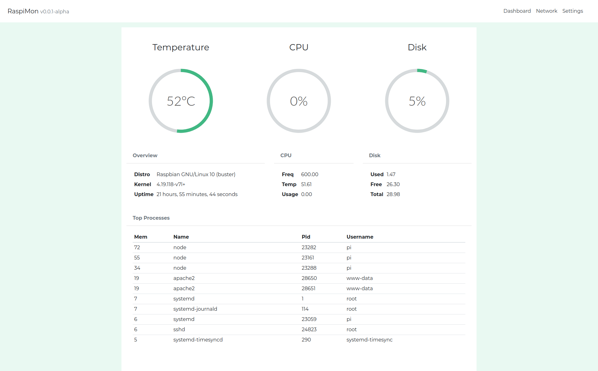

# RaspiMon

A lightweight monitor for your raspberry pi, works with the [RaspiMon API.](https://github.com/raekw0n/raspberry-pi-monitor-api)



## Installation

Clone this repository:
```bash
$ git clone git@github.com:raekw0n/raspberry-pi-monitor.git
$ cd raspberry-pi-monitor
```

Install dependencies:
```bash
$ npm install
```

Compile assets:
```bash
$ npm run build
```

## License
RaspiMon is open-sourced software licensed under the MIT license.
