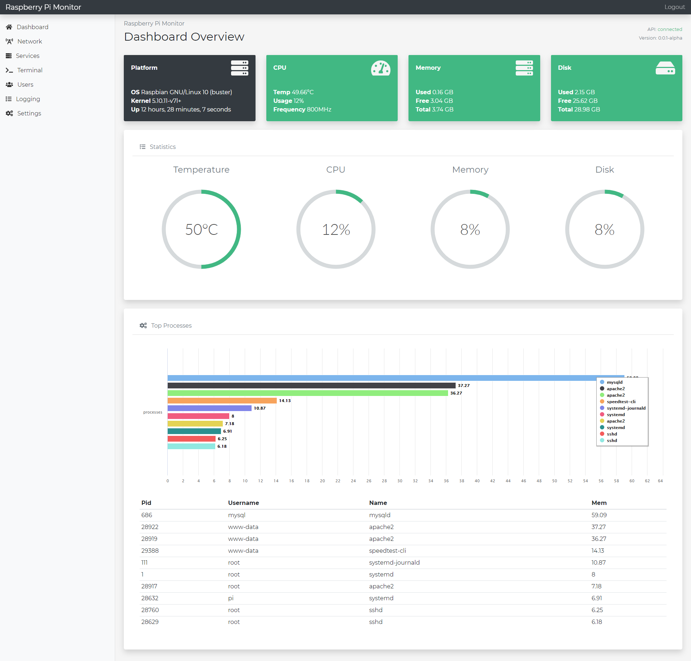

*** UPDATE ***

[V3 client](https://github.com/chrisrowles/pi-monitor-v3) has been released, it includes realtime monitoring through websockets, check it out!

# Pi Monitor

A lightweight monitor for your raspberry pi, works with the [API.](https://github.com/chrisrowles/pi-monitor-api)



## Installation

Clone this repository:
```bash
$ git clone git@github.com:raekw0n/raspi-mon.git
$ cd raspi-mon
```

Install dependencies:
```bash
$ npm install
```

Compile assets:
```bash
$ npm run build
```

## License
RaspiMon is open-sourced software licensed under the MIT license.
